# AWS Kubernetes CI/CD Pipeline (Dev → Staging → Production)

## 📌 Overview

This project implements a **production-style CI/CD pipeline** for deploying containerized applications on Kubernetes using AWS.

It follows a **multi-environment release strategy**:

* **Dev (CI)** → Build, validate, and push artifacts
* **Staging (CD)** → Deploy and test in pre-production
* **Production (CD)** → Deploy stable release

The pipeline automates the full lifecycle from **code commit → container build → Kubernetes deployment → validation**.

---

## 🏗️ Architecture

* Dockerized microservices (**Cats App & Dogs App**)
* Images stored in **Amazon ECR**
* Kubernetes cluster (Kind) running on AWS EC2
* Infrastructure partially managed via Terraform
* CI/CD orchestrated using GitHub Actions
* Remote deployment via SSH to EC2

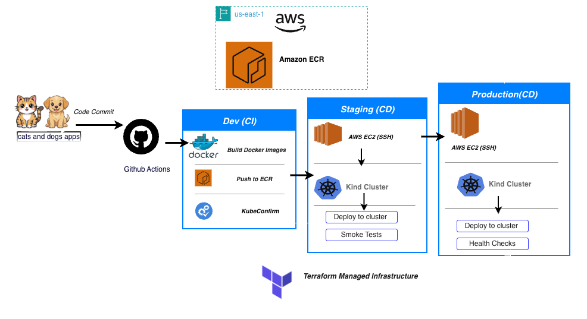 
---

## ⚙️ Tech Stack

* **AWS:** EC2, ECR, IAM
* **Containers:** Docker
* **Orchestration:** Kubernetes (Kind)
* **CI/CD:** GitHub Actions
* **IaC:** Terraform
* **Validation:** kubeconform
* **Scripting:** Bash

---

## 🔄 CI/CD Pipeline Design

### 🔹 1. Dev Branch — Continuous Integration (CI)

**Trigger:** Push to `dev`

**Key Steps:**

* Build Docker images for:

  * Cats service
  * Dogs service
* Push images to Amazon ECR
* Validate Kubernetes manifests using `kubeconform`

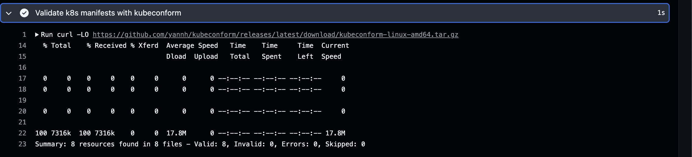

✅ Ensures code is **buildable and deployment-ready**

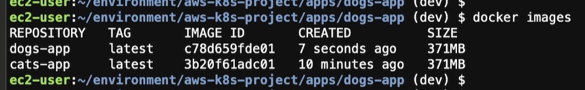
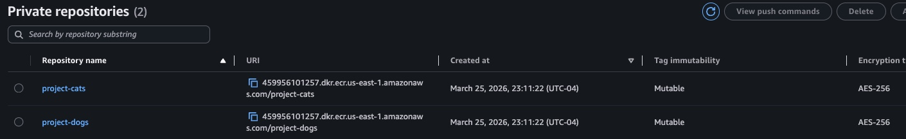
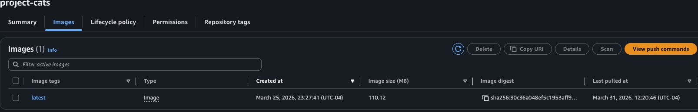
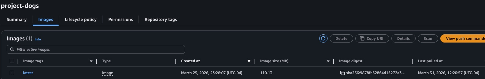
---

### 🔹 2. Staging Branch — Pre-Production Deployment

**Trigger:** Merge to `staging`

**Key Steps:**

* Connect to EC2 via SSH
* Ensure required tools are installed:

  * Docker
  * kind (Kubernetes)
  * kubectl
* Pull latest images from ECR
* Load images into Kind cluster
* Deploy Kubernetes manifests
* Restart deployments to apply updates
* Perform **smoke tests** via HTTP endpoints

✅ Simulates real deployment before production

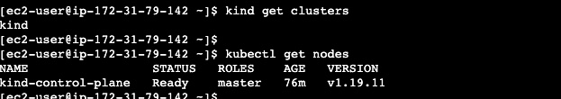
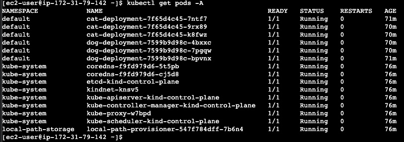
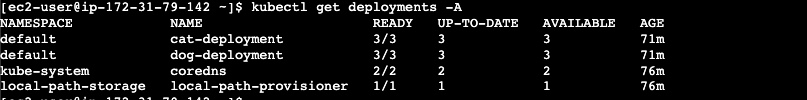
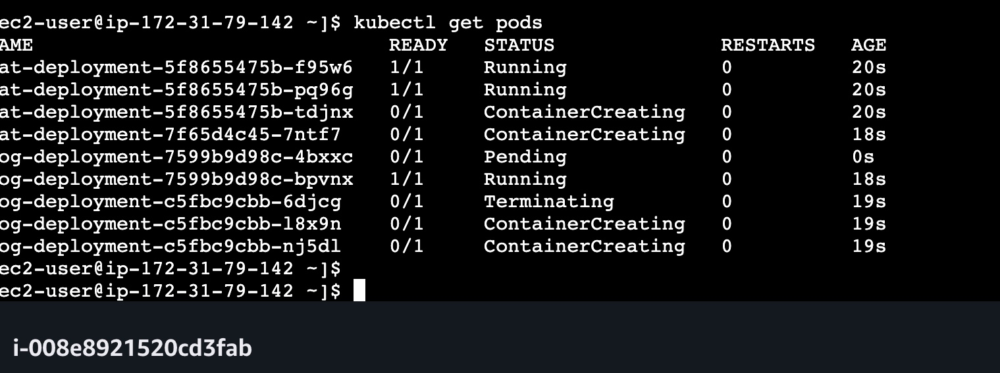
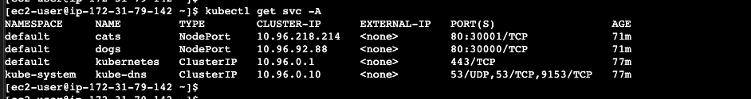

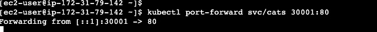
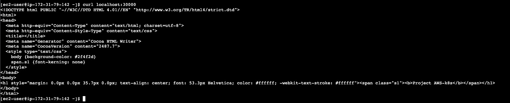

---

### 🔹 3. Main Branch — Production Deployment

**Trigger:** Merge to `main`

**Key Steps:**

* Same deployment flow as staging
* Runs under **production environment**
* Executes:

  * Kubernetes rollout
  * Health checks via curl
  * Deployment verification

✅ Ensures only validated code reaches production

---

## 📂 Project Structure

```
.
├── .github/workflows     # CI/CD pipelines (dev, staging, prod)
├── apps                  # Application source + Dockerfiles
├── K8s                   # Kubernetes manifests
├── terraform-infra       # Infrastructure configuration
└── README.md
```

---

## 🚀 Key Features

* Multi-branch deployment strategy (**dev → staging → prod**)
* Automated Docker image build & push to ECR
* Remote Kubernetes deployment via SSH
* Dynamic EC2 environment setup (Docker, kubectl, Kind)
* Kubernetes rollout automation
* Smoke testing after deployment
* Infrastructure-as-Code integration (Terraform)

---

## 🧠 What This Project Demonstrates

* Real-world CI/CD pipeline design
* Cloud-native deployment patterns
* Environment-based release workflows
* Kubernetes deployment lifecycle
* Secure AWS integration using GitHub secrets
* DevOps automation best practices

---

## 📊 Highlights 

* Designed a **multi-environment CI/CD pipeline** using GitHub Actions
* Automated Docker build & deployment to **AWS ECR and Kubernetes**
* Implemented **remote Kubernetes deployment** via EC2 using SSH
* Integrated **validation (kubeconform) and smoke testing** in pipeline
* Enabled **zero-manual deployment workflow** from commit to production

---

## 🔮 Future Improvements

* Migrate to AWS EKS (managed Kubernetes)
* Add Helm for deployment templating
* Integrate monitoring (Prometheus/Grafana)
* Implement blue-green or canary deployments
* Add automated test stage in CI

---

## 👤 Author

**Varnika Bassi**

